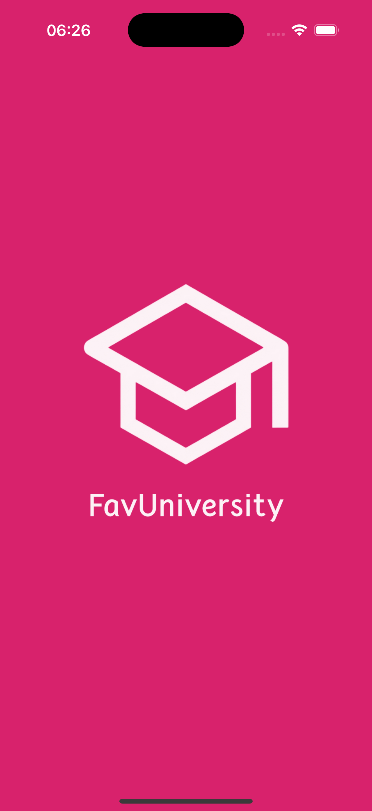
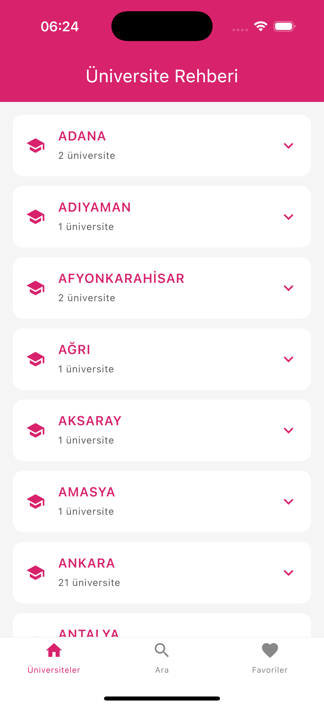
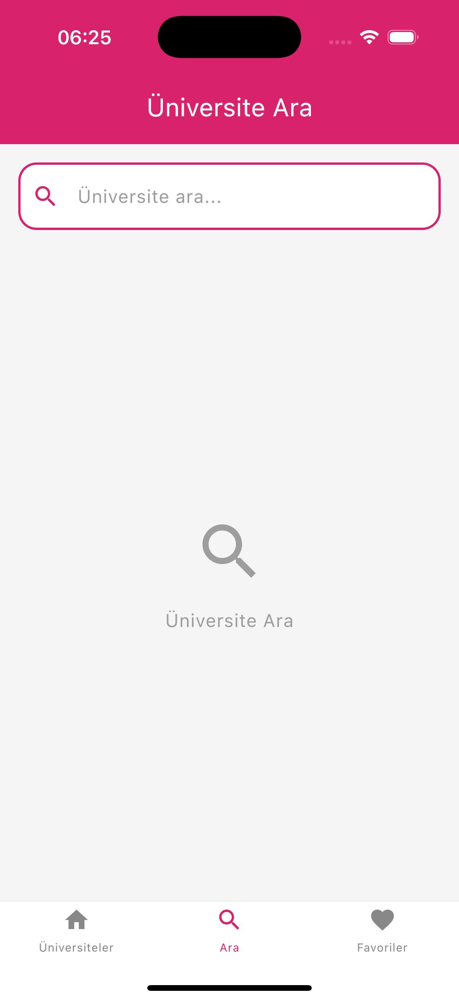
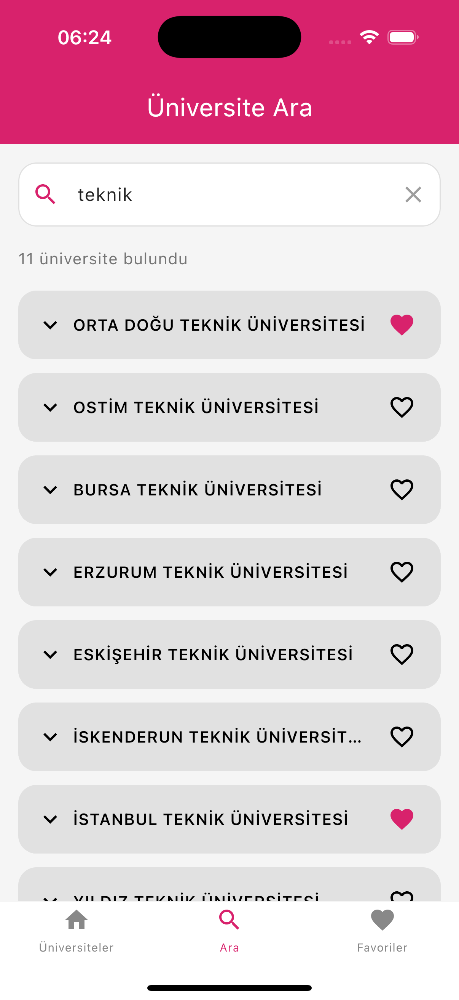
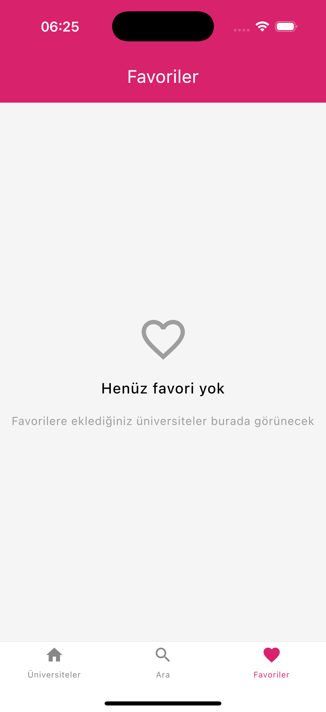
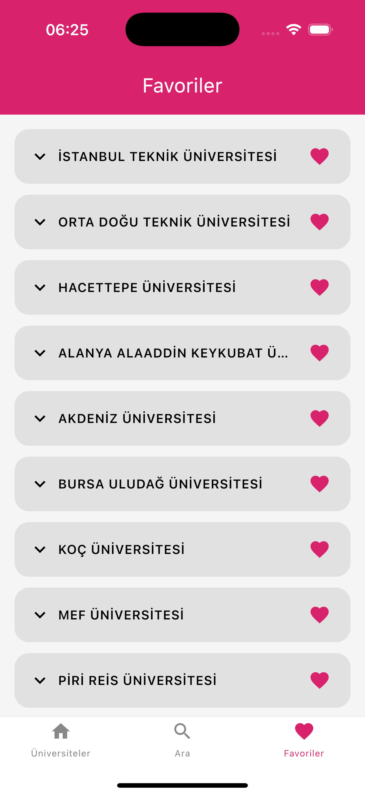
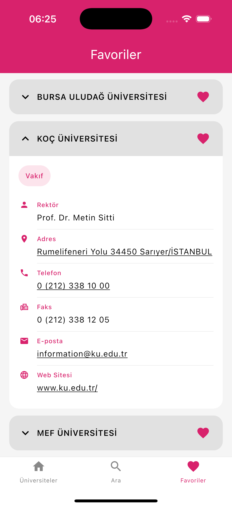

# FavUniversity 🎓

A Kotlin Multiplatform mobile application for browsing and bookmarking universities in Türkiye. Runs natively on both Android and iOS.

<p align="center">
  <a href="https://play.google.com/store/apps/details?id=com.huseyinkiran.favuniversity">
    
  </a>
</p>

## Features

- **Home Screen**: Browse universities organized by provinces with expandable cards
- **Search**: Search universities by name with real-time filtering
- **Favorites**: Save favorite universities with local database persistence
- **Cross-Platform**: Single codebase for Android and iOS

## Screenshots

<p align="center">
  
  
  
</p>

<p align="center">
  
  
  
</p>

<p align="center">
  
  
</p>

## Tech Stack

### Core Technologies
- **Kotlin Multiplatform** - Share business logic across platforms
- **Compose Multiplatform** - Declarative UI framework
- **Ktor Client** - HTTP networking
- **Koin** - Dependency injection
- **Room** - Local database for favorites
- **Navigation Compose** - Screen navigation

### Architecture
- **Clean Architecture** - Separation into Data, Domain, and Presentation layers
- **MVVM** - ViewModel-based state management
- **Repository Pattern** - Data access abstraction

## Dependencies

```kotlin
kotlin = "2.2.21"
composeMultiplatform = "1.9.3"
ktor = "3.3.3"
koin = "3.6.0-Beta4"
room = "2.8.4"
kotlinx-coroutines = "1.10.2"
navigation-compose = "2.9.1"
```

## Project Structure

```
composeApp/
├── commonMain/                 # Shared code (Android & iOS)
│   ├── common/                 # Utility classes (TimeCalculator, ErrorMessages)
│   ├── data/
│   │   ├── local/              # Room database, DAOs, entities
│   │   ├── remote/             # Ktor API client, DTOs
│   │   └── repository/         # Repository implementations
│   ├── domain/
│   │   ├── model/              # Domain models (University, City)
│   │   ├── repository/         # Repository interfaces
│   │   └── use_case/           # Business logic use cases
│   ├── presentation/
│   │   ├── navigation/         # Navigation setup, bottom bar, sealed screen class
│   │   ├── home/               # Home screen & ViewModel
│   │   ├── search/             # Search screen & ViewModel
│   │   ├── favorites/          # Favorites screen & ViewModel
│   │   ├── splash/             # Splash screen & ViewModel
│   │   ├── cards/              # Reusable UI components
│   │   └── platform/           # Platform-specific UI utilities
│   └── di/                     # Koin modules
├── androidMain/                # Android-specific code
│   └── kotlin/
│       ├── data/local/         # Android Room database configuration
│       ├── di/                 # Android dependency injection
│       └── presentation/       # Android-specific UI utilities
└── iosMain/                    # iOS-specific code
    └── kotlin/
        ├── data/local/         # iOS Room database configuration
        ├── di/                 # iOS dependency injection
        └── presentation/       # iOS-specific UI utilities
```

## Installation

### Requirements
- Android Studio Ladybug or later
- Xcode 15+ (for iOS development)
- JDK 17+

### Running the App

**Android:**
```bash
./gradlew :composeApp:installDebug
```

**iOS:**
- Open `iosApp/iosApp.xcodeproj` in Xcode
- Select a simulator or device and run

## API

The app uses a custom REST API:

**Base URL:** `https://favuniversity.huseyinkiran.site/api/provinces`

**Endpoint:**
- `GET /api/provinces?page={page}&pageSize={pageSize}` - Fetches university list

## Key Features

### State Preservation
Scroll position, expanded cards, and search queries are preserved when switching between tabs.

### Platform Behaviors
- **Android**: Back button on root tabs moves app to background
- **iOS**: Native swipe gesture support

---